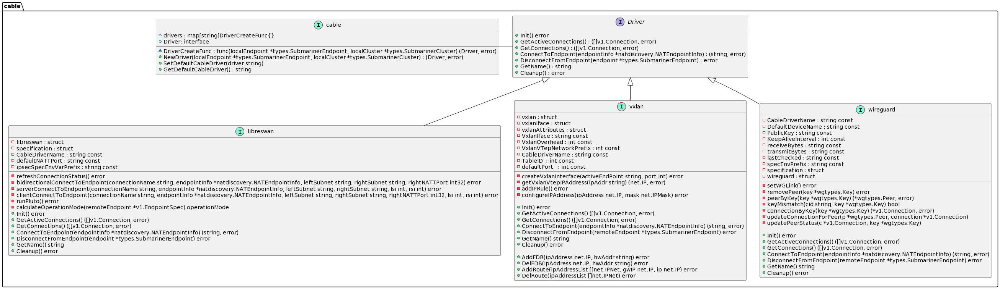
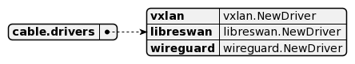
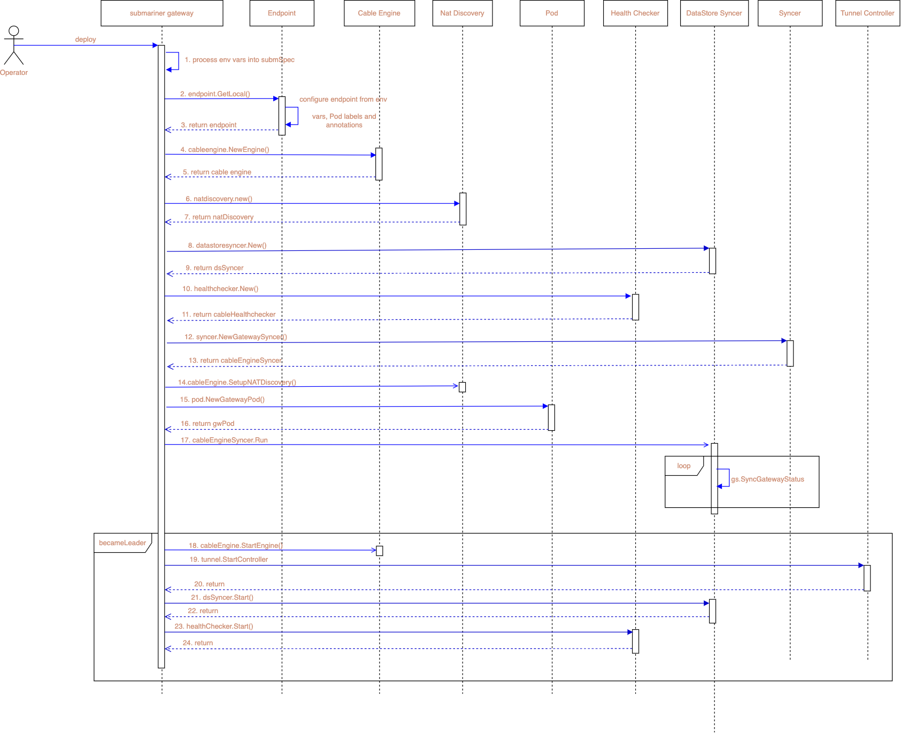
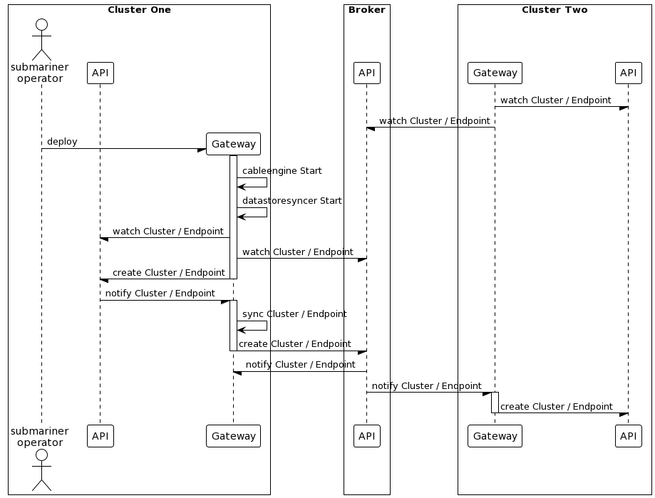
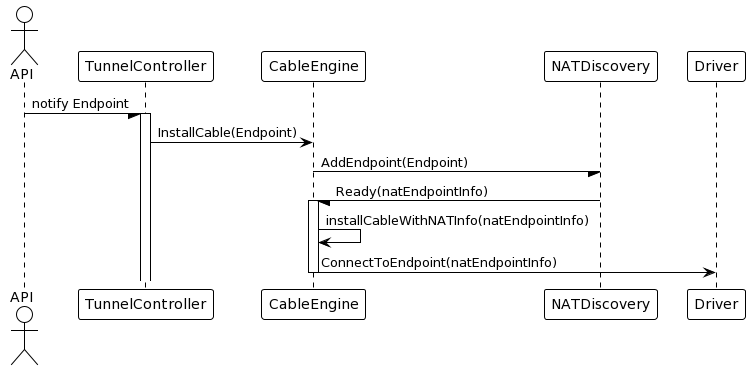
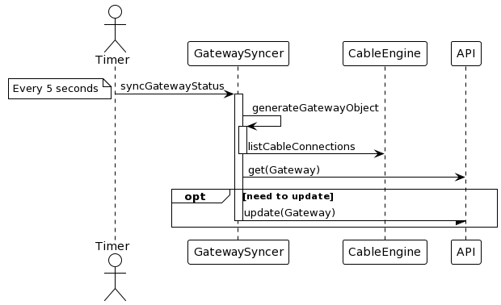

# Submariner Cable Driver

The goal of this writeup is to outline the current workings of the Submariner Cable Driver.

The following diagram outlines the existing Submariner cable drivers and their relationships.



## Cable Driver Startup

The cable package contains a static map of supported drivers. This map is a simple key value pair where
a key is the driver name and the value is a callback function that creates and returns a new cable driver.
This is shown in the diagram below.



A more detailed description of the drivers map and how elements are added is shown in the code block below:

```go
// Function prototype to create a new driver.
type DriverCreateFunc func(localEndpoint *types.SubmarinerEndpoint, localCluster *types.SubmarinerCluster) (Driver, error)

// Static map of supported drivers.
var drivers = map[string]DriverCreateFunc{}

// Adds a supported driver, prints a fatal error in the case of double registration.
func AddDriver(name string, driverCreate DriverCreateFunc) {
    if drivers[name] != nil {
        klog.Fatalf("Multiple cable engine drivers attempting to register with name %q", name)
    }

    drivers[name] = driverCreate
}
```

Each of the cable drivers (vxlan, wireguard and Libreswan) implements an init() function which populates
the drivers map when the submariner gateway starts. The following code extract from vxlan.go shows this
interaction.

```go
const (
    VxlanIface  = "vxlan-tunnel"
    ...
)

func init() {
    cable.AddDriver(CableDriverName, NewDriver)
}

func NewDriver(localEndpoint *types.SubmarinerEndpoint, localCluster *types.SubmarinerCluster) (cable.Driver, error) {
    ...
}
```

In the case of Libreswan it also registers/sets itself as the default cable driver:

```go
func init() {
    cable.AddDriver(cableDriverName, NewLibreswan)
    cable.SetDefaultCableDriver(cableDriverName)
}
```

## Cable Engine Startup

The cable driver is configured by the `SubmarinerSpecification`. This is  defined as a Custom Resource, an example
of which is shown below.

```yaml
---
apiVersion: submariner.io/v1alpha1
kind: Submariner
metadata:
  name: submariner
spec:
  serviceCIDR: "192.168.66.0/24"
  clusterCIDR: "192.168.67.0/24"
  globalCIDR: ""
  clusterID: "cluster1"
  debug: false
  natEnabled: true
  serviceDiscoveryEnabled: true
  broker: "k8s"
  brokerK8sApiServer: "192.168.67.110:8443"
  brokerK8sApiServerToken: "$(BROKER_K8S_API_TOKEN)"
  brokerK8sRemoteNamespace: "submariner-k8s-broker"
  brokerK8sCA: "$(BROKER_K8S_CA)"
  cableDriver: "libreswan"
  ceIPSecPSK: "$(IPSEC_PSK)"
  ceIPSecDebug: false
  ceIPSecIKEPort: 500
  ceIPSecNATTPort: 4500
  namespace: "$(SUBMARINER_OPERATOR_NAMESPACE)"
  repository: repo
  version: "$(VERSION)"
  connectionHealthCheck:
    enabled: false
    intervalSeconds: 1
    maxPacketLossCount: 5
```

The various parameters specified above are injected into the gateway Pod as environment variables, an example is shown below.

```bash
[root@cluster1-worker submariner]# env | grep -i submariner
SUBMARINER_LIGHTHOUSE_AGENT_METRICS_PORT_8082_TCP=tcp://100.1.201.134:8082
SUBMARINER_LIGHTHOUSE_COREDNS_METRICS_SERVICE_PORT_METRICS=9153
SUBMARINER_LIGHTHOUSE_COREDNS_METRICS_PORT_9153_TCP_PORT=9153
SUBMARINER_OPERATOR_METRICS_PORT_8383_TCP_PROTO=tcp
SUBMARINER_SERVICECIDR=100.1.0.0/16
SUBMARINER_LIGHTHOUSE_COREDNS_SERVICE_HOST=100.1.11.222
SUBMARINER_GATEWAY_METRICS_PORT_8080_TCP_PROTO=tcp
SUBMARINER_LIGHTHOUSE_AGENT_METRICS_SERVICE_PORT=8082
SUBMARINER_OPERATOR_METRICS_PORT_8686_TCP_PORT=8686
SUBMARINER_CABLEDRIVER=libreswan
SUBMARINER_LIGHTHOUSE_COREDNS_METRICS_PORT_9153_TCP=tcp://100.1.47.150:9153
SUBMARINER_LIGHTHOUSE_COREDNS_PORT_53_UDP_PROTO=udp
SUBMARINER_GATEWAY_METRICS_SERVICE_PORT=8080
SUBMARINER_GATEWAY_METRICS_PORT_8080_TCP_PORT=8080
SUBMARINER_OPERATOR_METRICS_PORT_8686_TCP_ADDR=100.1.151.134
SUBMARINER_HEALTHCHECKINTERVAL=1
SUBMARINER_LIGHTHOUSE_COREDNS_METRICS_PORT=tcp://100.1.47.150:9153
SUBMARINER_LIGHTHOUSE_COREDNS_METRICS_SERVICE_HOST=100.1.47.150
SUBMARINER_LIGHTHOUSE_COREDNS_METRICS_PORT_9153_TCP_ADDR=100.1.47.150
SUBMARINER_OPERATOR_METRICS_SERVICE_PORT_CR_METRICS=8686
SUBMARINER_OPERATOR_METRICS_PORT_8383_TCP_ADDR=100.1.151.134
SUBMARINER_LIGHTHOUSE_AGENT_METRICS_PORT=tcp://100.1.201.134:8082
SUBMARINER_LIGHTHOUSE_AGENT_METRICS_SERVICE_PORT_METRICS=8082
SUBMARINER_GATEWAY_METRICS_SERVICE_HOST=100.1.105.81
SUBMARINER_HEALTHCHECKENABLED=true
SUBMARINER_OPERATOR_METRICS_SERVICE_HOST=100.1.151.134
SUBMARINER_GLOBALCIDR=
SUBMARINER_GATEWAY_METRICS_PORT_8080_TCP=tcp://100.1.105.81:8080
SUBMARINER_LIGHTHOUSE_COREDNS_PORT=udp://100.1.11.222:53
SUBMARINER_LIGHTHOUSE_AGENT_METRICS_SERVICE_HOST=100.1.201.134
SUBMARINER_NAMESPACE=submariner-operator
SUBMARINER_CLUSTERID=cluster1
SUBMARINER_COLORCODES=
SUBMARINER_LIGHTHOUSE_AGENT_METRICS_PORT_8082_TCP_PORT=8082
SUBMARINER_DEBUG=false
SUBMARINER_GATEWAY_METRICS_PORT=tcp://100.1.105.81:8080
SUBMARINER_LIGHTHOUSE_COREDNS_SERVICE_PORT=53
SUBMARINER_LIGHTHOUSE_COREDNS_PORT_53_UDP=udp://100.1.11.222:53
SUBMARINER_LIGHTHOUSE_COREDNS_PORT_53_UDP_PORT=53
SUBMARINER_OPERATOR_METRICS_PORT_8686_TCP_PROTO=tcp
SUBMARINER_GATEWAY_METRICS_PORT_8080_TCP_ADDR=100.1.105.81
SUBMARINER_OPERATOR_METRICS_PORT=tcp://100.1.151.134:8383
SUBMARINER_LIGHTHOUSE_COREDNS_METRICS_PORT_9153_TCP_PROTO=tcp
SUBMARINER_CLUSTERCIDR=10.1.0.0/16
BROKER_K8S_REMOTENAMESPACE=submariner-k8s-broker
SUBMARINER_GATEWAY_METRICS_SERVICE_PORT_METRICS=8080
SUBMARINER_BROKER=k8s
SUBMARINER_LIGHTHOUSE_AGENT_METRICS_PORT_8082_TCP_ADDR=100.1.201.134
SUBMARINER_HEALTHCHECKMAXPACKETLOSSCOUNT=5
SUBMARINER_OPERATOR_METRICS_PORT_8686_TCP=tcp://100.1.151.134:8686
SUBMARINER_OPERATOR_METRICS_SERVICE_PORT=8383
SUBMARINER_LIGHTHOUSE_AGENT_METRICS_PORT_8082_TCP_PROTO=tcp
SUBMARINER_OPERATOR_METRICS_PORT_8383_TCP_PORT=8383
SUBMARINER_OPERATOR_METRICS_SERVICE_PORT_HTTP_METRICS=8383
SUBMARINER_NATENABLED=false
SUBMARINER_OPERATOR_METRICS_PORT_8383_TCP=tcp://100.1.151.134:8383
SUBMARINER_LIGHTHOUSE_COREDNS_METRICS_SERVICE_PORT=9153
SUBMARINER_LIGHTHOUSE_COREDNS_PORT_53_UDP_ADDR=100.1.11.222
SUBMARINER_LIGHTHOUSE_COREDNS_SERVICE_PORT_UDP=53
```

From a cable driver perspective, at start up time, the configuration parameter of interest is `SUBMARINER_CABLEDRIVER`.
If this parameter is not specified, then the default cable driver that is registered through the init() functions at the gateway
startup time is selected.

At startup time the gateway reads in these environment variables into a `SubmarinerSpecification` called `submSpec`. The gateway checks
if a cable driver is configured, if not - it sets the default cable driver as the cable driver in `submSpec`. The gateway then creates a
local `endpoint` which sets the backend as the cable driver from `submSpec`. The local endpoint parameters/settings are gathered from
environment variables as well as Pod labels and annotations.

```go
    endpoint := &types.SubmarinerEndpoint{
        Spec: submv1.EndpointSpec{
            CableName:     fmt.Sprintf("submariner-cable-%s-%s", submSpec.ClusterID, strings.ReplaceAll(privateIP, ".", "-")),
            ClusterID:     submSpec.ClusterID,
            Hostname:      hostname,
            PrivateIP:     privateIP,
            NATEnabled:    submSpec.NATEnabled,
            Subnets:       localSubnets,
            Backend:       submSpec.CableDriver,
            BackendConfig: backendConfig,
        },
    }
```

This information can be eventually be seen in the gateway description on the cluster after it's been synced to the Kubernetes API.

```yaml
  Local Endpoint:
    Backend:  vxlan
    backend_config:
      Natt - Discovery - Port:  4490
      Preferred - Server:       false
      Udp - Port:               4500
    cable_name:                 submariner-cable-cluster1-172-18-0-4
    cluster_id:                 cluster1
    Health Check IP:            10.1.0.1
    Hostname:                   cluster1-worker
    nat_enabled:                false
    private_ip:                 172.18.0.4
    public_ip:                  66.187.232.132
```

The gateway then creates the `cableengine.Engine` based on the local endpoint and cluster configuration it received from
`submSpec`. It also creates a number of objects (e.g `natdiscovery.Interface`, `healthchecker.Interface`) that are used as
part of the various Submariner watchers and syncers (e.g. `datastoresyncer.DatastoreSyncer`, `pod.NewGatewayPod` and
`syncer.GatewaySyncer`...).

> **_NOTE1:_** `datastoresyncer.DatastoreSyncer` is responsible for bi-directional syncing  cluster and endpoint resources 
> with the central broker (via Admiral). It also watches the nodes for creation/update events and determines if local endpoint 
> update is necessary (for example in the event of the changing of the gateway node).
>
> **_NOTE2:_** `syncer.GatewaySyncer` is responsible for creating and syncing the gateway connection information (including 
> things like the `Local Endpoint` that can be seen with the command below, the connections and their status...) with the 
> central broker.
> $ kubectl describe gateways -n submariner-operator cluster1-worker
>
> **_NOTE3:_** `pod.NewGatewayPod` is a handler responsible for creating and updating the gateway pod labels.
> **_NOTE4:_** `The tunnel controller watches for Endpoint resources then installs or removes cables in the cable engine.

Finally, when all the relevant objects are created the `syncer.GatewaySyncer` is set to run.

> **_NOTE:_** at this point the cable engine is not running yet.

The next stage of startup involves leader election among the gateways leveraging the [kubernetes leader election](https://itnext.io/leader-election-in-kubernetes-using-client-go-a19cbe7a9a85) process using the `ConfigMap` lock object shown below.

```bash
[submariner-operator]# kubectl describe configmaps -n submariner-operator submariner-gateway-lock
Name:         submariner-gateway-lock
Namespace:    submariner-operator
Labels:       <none>
Annotations:  control-plane.alpha.kubernetes.io/leader:
                {"holderIdentity":"cluster1-worker-submariner-gateway","leaseDurationSeconds":10,"acquireTime":"2022-03-15T13:38:47Z","renewTime":"2022-03...

Data
====
Events:  <none>
```

The node that is the leader starts the cable engine, sets the Pod labels appropriately, starts the tunnel controller, starts the datasyncer,
and starts the healthchecker.

### Submariner gateway initialization diagram

The following image is a sequence diagram of Submariner gateway initialization.



## Clusters & Endpoints

The following image shows the cluster and endpoint initialization and updates via the `DatastoreSyncer`


## Cable engine tunnel controller

The tunnel controller watches for Endpoint resources then installs or removes cables in the
cable engine.


## Gateway syncer

The Gateway resource provides status about the connections, including healthcheck metrics. The
Gateway resource for a cluster is generated from the cable driver's list of connections. The
resource gets updated every 5 seconds.


