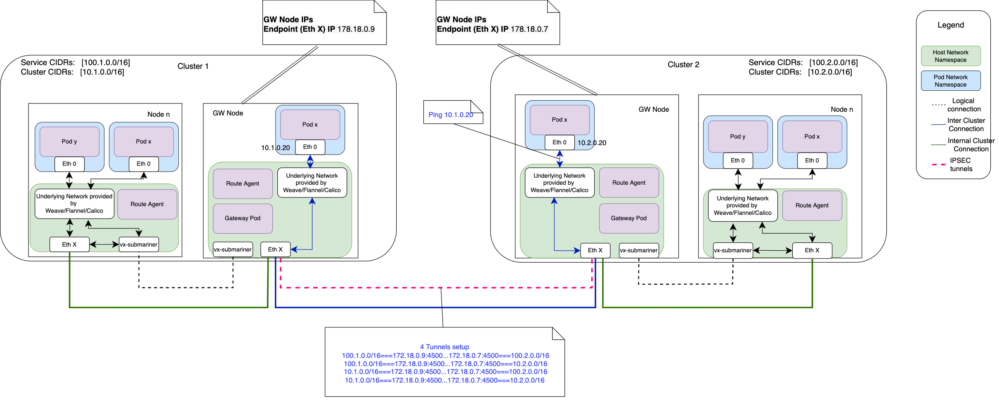

# Submariner IPSec Cable Driver Overview

The goal of this guide is to provide an overview of the IPSec cable driver in Submariner and its equivalent
manual configuration as well as an overview of transport mode configuration.

## Submariner IPSec topology

The following is a topology overview for a simple Submariner deployment deployed with the IPSec cable Driver:

```bash
# make deploy using=lighthouse
```

The idea is to show a simple interaction (a ping from one pod in one cluster to another pod in a second cluster) when Submariner is used.



Please note: 4 tunnels are established to allow for:

- Pod subnet to Pod subnet connectivity
- Pod subnet to Service subnet connectivity
- Service subnet to Pod subnet connectivity
- Service subnet to Service subnet connectivity

## IPSec manual configuration equivalent - tunnel mode

An equivalent IPSec configuration to what submariner sets up is shown below, this configuration is
applied to a VXLAN deployment.

> **_NOTE:_** you can apply the configuration below to a vxlan deployment to see it in action.

### Cluster Information

```bash
[submariner-operator]# subctl show all
Cluster "cluster1"
 ✓ Showing Connections
GATEWAY          CLUSTER   REMOTE IP   NAT  CABLE DRIVER  SUBNETS                    STATUS     RTT avg.
cluster2-worker  cluster2  172.18.0.7  no   vxlan         100.2.0.0/16, 10.2.0.0/16  connected  442.987µs

 ✓ Showing Endpoints
CLUSTER ID                    ENDPOINT IP     PUBLIC IP       CABLE DRIVER        TYPE
cluster1                      172.18.0.9      66.187.232.132  vxlan               local
cluster2                      172.18.0.7      66.187.232.132  vxlan               remote

 ✓ Showing Gateways
NODE                            HA STATUS       SUMMARY
cluster1-worker                 active          All connections (1) are established

    Discovered network details via Submariner:
        Network plugin:  weave-net
        Service CIDRs:   [100.1.0.0/16]
        Cluster CIDRs:   [10.1.0.0/16]
 ✓ Showing Network details

COMPONENT                       REPOSITORY                                            VERSION
submariner                      localhost:5000                                        local
submariner-operator             localhost:5000                                        local
service-discovery               localhost:5000                                        local
 ✓ Showing versions

Cluster "cluster2"
 ✓ Showing Connections
GATEWAY          CLUSTER   REMOTE IP   NAT  CABLE DRIVER  SUBNETS                    STATUS     RTT avg.
cluster1-worker  cluster1  172.18.0.9  no   vxlan         100.1.0.0/16, 10.1.0.0/16  connected  475.65µs

 ✓ Showing Endpoints
CLUSTER ID                    ENDPOINT IP     PUBLIC IP       CABLE DRIVER        TYPE
cluster2                      172.18.0.7      66.187.232.132  vxlan               local
cluster1                      172.18.0.9      66.187.232.132  vxlan               remote

 ✓ Showing Gateways
NODE                            HA STATUS       SUMMARY
cluster2-worker                 active          All connections (1) are established

    Discovered network details via Submariner:
        Network plugin:  weave-net
        Service CIDRs:   [100.2.0.0/16]
        Cluster CIDRs:   [10.2.0.0/16]
 ✓ Showing Network details

COMPONENT                       REPOSITORY                                            VERSION
submariner                      localhost:5000                                        local
submariner-operator             localhost:5000                                        local
service-discovery               localhost:5000                                        local
 ✓ Showing versions
```

### Cluster 1 Gateway configuration

```bash
#[root@cluster1-worker submariner]# cat /etc/ipsec.d/submariner.conf
conn test-vpn-svc
   also=tunnel
   leftsubnets=100.1.0.0/16
   rightsubnets=100.2.0.0/16

conn test-vpn-pods
   also=tunnel
   leftsubnets=10.1.0.0/16
   rightsubnets=10.2.0.0/16

conn test-vpn-mixed1
   also=tunnel
   leftsubnets=100.1.0.0/16
   rightsubnets=10.2.0.0/16

conn test-vpn-mixed2
   also=tunnel
   leftsubnets=10.1.0.0/16
   rightsubnets=100.2.0.0/16

conn tunnel
   left=172.18.0.9
   right=172.18.0.7
   authby=secret
   pfs=yes
   rekey=yes
   keyingtries=3
   type=tunnel
   auto=start
   ike=aes_gcm-sha2;modp2048
   phase2alg=aes_gcm-null;modp2048
```

### Configure the IPSec secret on cluster 1

Configure the IPSec secret to use the PSK:

```bash
[root@cluster2-worker submariner]# cat /etc/ipsec.d/test.secrets
%any %any: PSK "yLvPmaM+/TxWHjkV5+upGHQWbwI+aif0ihchZpxght71zJFlXiKUBD31AXsLnGrt"
```

### Cluster 2 Gateway configuration

```bash
[root@cluster2-worker submariner]# cat /etc/ipsec.d/submariner.conf
conn test-vpn-svc
   also=tunnel
   leftsubnets=100.2.0.0/16
   rightsubnets=100.1.0.0/16

conn test-vpn-pods
   also=tunnel
   leftsubnets=10.2.0.0/16
   rightsubnets=10.1.0.0/16

conn test-vpn-mixed1
   also=tunnel
   leftsubnets=100.2.0.0/16
   rightsubnets=10.1.0.0/16

conn test-vpn-mixed2
   also=tunnel
   leftsubnets=10.2.0.0/16
   rightsubnets=100.1.0.0/16

conn tunnel
   left=172.18.0.7
   right=172.18.0.9
   authby=secret
   pfs=yes
   rekey=yes
   keyingtries=3
   type=tunnel
   auto=start
   ike=aes_gcm-sha2;modp2048
   phase2alg=aes_gcm-null;modp2048
```

### Configure the IPSec secret on cluster 2

Configure the IPSec secret to use the PSK by writing the PSK to /etc/ipsec.d/test.secrets

```bash
[root@cluster2-worker submariner]# cat /etc/ipsec.d/test.secrets
%any %any: PSK "yLvPmaM+/TxWHjkV5+upGHQWbwI+aif0ihchZpxght71zJFlXiKUBD31AXsLnGrt"
```

### Run Pluto on both gateways

```bash
[root@cluster1-worker submariner]# pluto --stderrlog
[root@cluster2-worker submariner]# pluto --stderrlog
```

### IPSec STATUS on the gateways

You can see the state of the configured tunnels using:

```bash
# ipsec whack --status
```

To see the stats for the tunnels use:

```bash
#ipsec whack --trafficstatus
```

### Verification

You can verify connectivity and traffic flow across the tunnels by:

- Bringing up two Pods and pinging from one Pod to another.
- Or running the deployment verification steps from the [Submariner documentation](https://submariner.io/getting-started/quickstart/kind/#verify-deployment)

## IPSec manual configuration - transport mode - VXLAN over IPSec

> **_NOTE:_** This section assumes you've deployed Submariner with the VXLAN cable driver and adjusted the nattport to 4789

### Setup the IPSec secrets using the Submariner PSK

#### Configure the IPSec secret on cluster 1 GW

cat the PSK environment variable in the Submariner Gw.

Configure the IPSec secret to use the PSK by adding it to `/etc/ipsec.d/test.secrets`:

```bash
[root@cluster1-worker submariner]# cat /etc/ipsec.d/test.secrets
%any %any: PSK "yLvPmaM+/TxWHjkV5+upGHQWbwI+aif0ihchZpxght71zJFlXiKUBD31AXsLnGrt"
```

#### Configure the IPSec secret on cluster 2 GW

cat the PSK environment variable in the Submariner Gw.

Configure the IPSec secret to use the PSK by adding it to `/etc/ipsec.d/test.secrets`:

```bash
[root@cluster2-worker submariner]# cat /etc/ipsec.d/test.secrets
%any %any: PSK "yLvPmaM+/TxWHjkV5+upGHQWbwI+aif0ihchZpxght71zJFlXiKUBD31AXsLnGrt"
```

### Configure ipsec.conf on both clusters

You can either do the configuration listed here or follow the ipsec whack methodology.

> **_NOTE:_** to use the default Submariner vxlan port replace `udp/vxlan` in the configurations below with `udp/4500`

   ```bash
   [root@cluster1-worker submariner]# cat /etc/ipsec.d/sub.conf
   conn transport-out
      also=transport
      leftprotoport=udp
      rightprotoport=udp/vxlan
      auto=start

   conn transport-in
      also=transport
      leftprotoport=udp/vxlan
      rightprotoport=udp
      auto=start

   conn transport
   left=172.18.0.9
   right=172.18.0.7
   authby=secret
   pfs=yes
   rekey=yes
   keyingtries=3
   type=transport
   ike=aes_gcm-sha2;modp2048
   phase2alg=aes_gcm-null;modp2048
   ```

   ```bash
   [root@cluster2-worker submariner]# cat /etc/ipsec.d/sub.conf
   conn transport-out
      also=transport
      leftprotoport=udp
      rightprotoport=udp/vxlan
      auto=start

   conn transport-in
      also=transport
      leftprotoport=udp/vxlan
      rightprotoport=udp
      auto=start

   conn transport
      left=172.18.0.7
      right=172.18.0.9
      authby=secret
      pfs=yes
      rekey=yes
      keyingtries=3
      type=transport
      ike=aes_gcm-sha2;modp2048
      phase2alg=aes_gcm-null;modp2048
   ```

Start Pluto and send traffic

### Configure IPSec transport mode using whack

Setup the IPSec secrets on both clusters as shown above.

An alternative configuration with `ipsec whack` is shown below:

> **_NOTE:_** to use the default Submariner vxlan port replace `udp/vxlan` in the configurations below with `udp/4500`

<!-- markdownlint-disable line-length -->
```bash
[root@cluster1-worker]# pluto --stderrlog
[root@cluster1-worker]# ipsec whack --psk --encrypt --name submariner-cable-cluster2-172-18-0-9-0 --host 172.18.0.11 --clientproto udp/vxlan --to --host 172.18.0.9 --clientproto udp 
[root@cluster1-worker]# ipsec whack --psk --encrypt  --name submariner-cable-cluster2-172-18-0-9-1 --host 172.18.0.11 --clientproto udp --to --host 172.18.0.9 --clientproto udp/vxlan
[root@cluster1-worker]# ipsec whack --route --name submariner-cable-cluster2-172-18-0-9-0
[root@cluster1-worker]# ipsec whack --route --name submariner-cable-cluster2-172-18-0-9-1
[root@cluster1-worker]# ipsec whack --initiate --asynchronous --name submariner-cable-cluster2-172-18-0-9-0
[root@cluster1-worker]# ipsec whack --initiate --asynchronous --name submariner-cable-cluster2-172-18-0-9-1
```
<!-- markdownlint-enable line-length -->

<!-- markdownlint-disable line-length -->
```bash
[root@cluster2-worker]# pluto --stderrlog
[root@cluster2-worker]# ipsec whack --psk --encrypt --name submariner-cable-cluster1-172-18-0-11-0 --host 172.18.0.9 --clientproto udp/vxlan --to --host 172.18.0.11 --clientproto udp 
[root@cluster2-worker]# ipsec whack --psk --encrypt --name submariner-cable-cluster1-172-18-0-11-1 --host 172.18.0.9 --clientproto udp --to --host 172.18.0.11 --clientproto udp/vxlan
[root@cluster2-worker]# ipsec whack --route --name submariner-cable-cluster1-172-18-0-11-0
[root@cluster2-worker]# ipsec whack --route --name submariner-cable-cluster1-172-18-0-11-1
[root@cluster2-worker]# ipsec whack --initiate --asynchronous --name submariner-cable-cluster1-172-18-0-11-0
[root@cluster2-worker]# ipsec whack --initiate --asynchronous --name submariner-cable-cluster1-172-18-0-11-1
```
<!-- markdownlint-enable line-length -->

Send traffic

You can see the state of the configured tunnels using:

```bash
# ipsec whack --status
```

To see the stats for the tunnels use:

```bash
#ipsec whack --trafficstatus
```

## IPSec manual configuration - transport mode - IP in IP over IPSec

> **_NOTE:_** This section assumes you've deployed Submariner with the IPTun cable driver

1. Setup the secrets as shown above.

2. Configure ipsec.conf on both clusters:

   ```bash
   [root@cluster1-worker submariner]# cat /etc/ipsec.d/sub.conf
   conn transport
      left=172.18.0.9
      right=172.18.0.7
      leftprotoport=ipv4
      rightprotoport=ipv4
      authby=secret
      pfs=yes
      rekey=yes
      keyingtries=3
      type=transport
      auto=start
      ike=aes_gcm-sha2;modp2048
      phase2alg=aes_gcm-null;modp2048
   ```

   ```bash
   [root@cluster2-worker submariner]# cat /etc/ipsec.d/sub.conf
   conn transport
      left=172.18.0.7
      right=172.18.0.9
      leftprotoport=ipv4
      rightprotoport=ipv4
      authby=secret
      pfs=yes
      rekey=yes
      keyingtries=3
      type=transport
      auto=start
      ike=aes_gcm-sha2;modp2048
      phase2alg=aes_gcm-null;modp2048
   ```

3. Start Pluto and send traffic

An alternative configuration with `ipsec whack` is shown below:

<!-- markdownlint-disable line-length -->
```bash
[root@cluster1-worker]# pluto --stderrlog
[root@cluster1-worker]# ipsec whack --psk --encrypt --name submariner-cable-cluster2-172-18-0-9-0 --host 172.18.0.11 --clientproto ipv4 --to --host 172.18.0.9 --clientproto ipv4 
[root@cluster1-worker]# ipsec whack --route --name submariner-cable-cluster2-172-18-0-9-0
[root@cluster1-worker]# ipsec whack --initiate --asynchronous --name submariner-cable-cluster2-172-18-0-9-0
```
<!-- markdownlint-enable line-length -->

<!-- markdownlint-disable line-length -->
```bash
[root@cluster2-worker]# pluto --stderrlog
[root@cluster2-worker]# ipsec whack --psk --encrypt --name submariner-cable-cluster1-172-18-0-11- --host 172.18.0.9 --clientproto ipv4 --to --host 172.18.0.11 --clientproto ipv4 
[root@cluster2-worker]# ipsec whack --route --name submariner-cable-cluster1-172-18-0-11-0
[root@cluster2-worker]# ipsec whack --initiate --asynchronous --name submariner-cable-cluster1-172-18-0-11-0
```
<!-- markdownlint-enable line-length -->
