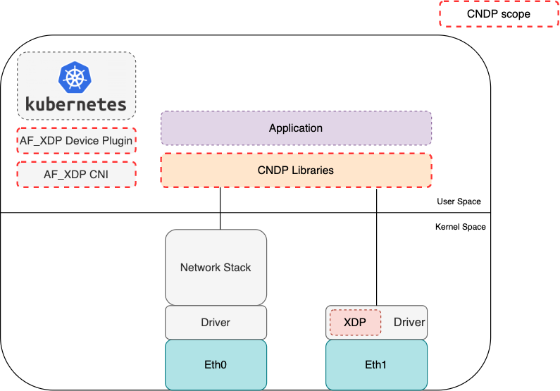
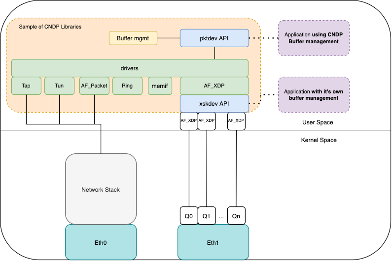

# Cloud Native Data Plane (CNDP) overview

CNDP is a user space framework that provides a set of libraries as well as the Kubernetes
components (where necessary) for Cloud Native Packet Processing Applications. A high level
view of CNDP is shown below:

CNDP was originally created to enable cloud native developers to use AF_XDP and other interfaces
in a simple way while providing better performance as compared to standard Linux networking
interfaces. Some of the I/O interfaces CNDP supports include: AF_XDP, Tun, Tap and AF_PACKET.

CNDP is built on top of standard Linux networking interfaces and takes advantage of operating system
mechanisms (memory allocation, scheduling, drivers...). It aims to work with the kernel to accomplish
a balance between flexibility (of deployment) and performance (of the packet processing application).

> **_NOTE1:_** drivers/pmd is the terminology deployed by CNDP, however CNDP doesn't implement
> any drivers, it's simple an I/O API. CNDP leverages the Linux Kernel Drivers to manage networking
> devices.

Applications can interact with these "drivers" using one of two APIs:

- pktdev API: for applications that want to interact with any of the underlying drivers and leverage
  CNDPs buffer management utilities.
- xskdev API: a special API, that wraps the low level AF_XDP APIs. Applications can interact
  directly with this API if they wish to use their own buffer management libraries/utilities.

Both APIs abstract the complexities of the underlying "drivers" and low level APIs they interact with from
the end user.

> **_NOTE1:_** CNDP **applies many of the learnings from DPDK and VPP in its libraries but is completely
> independent of both of these projects**.
> CNDP aims to work with/leverage the Linux kernel to accomplish a balance between flexibility and performance,
> it leaves device management to the Kernel.
>
> **_NOTE2:_** CNDP does not replace DPDK (Data Plane Development Kit), which provides the highest performance
> for packet processing. DPDK implements user space drivers, bypassing the kernel drivers. This approach of rewriting
> drivers is one reason DPDK achieves the highest performance for packet processing.

## Getting Started with CNDP

To get started with CNDP, checkout the [github repo](https://github.com/CloudNativeDataPlane/cndp). A [quick install guide](https://github.com/CloudNativeDataPlane/cndp/blob/main/INSTALL.md) shows how to run the simplest of CNDP examples.
