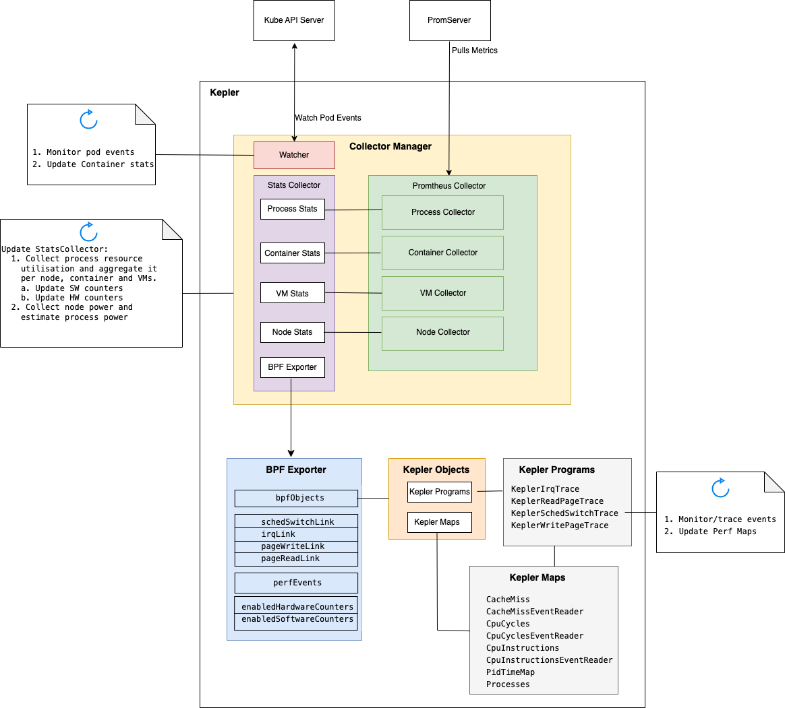
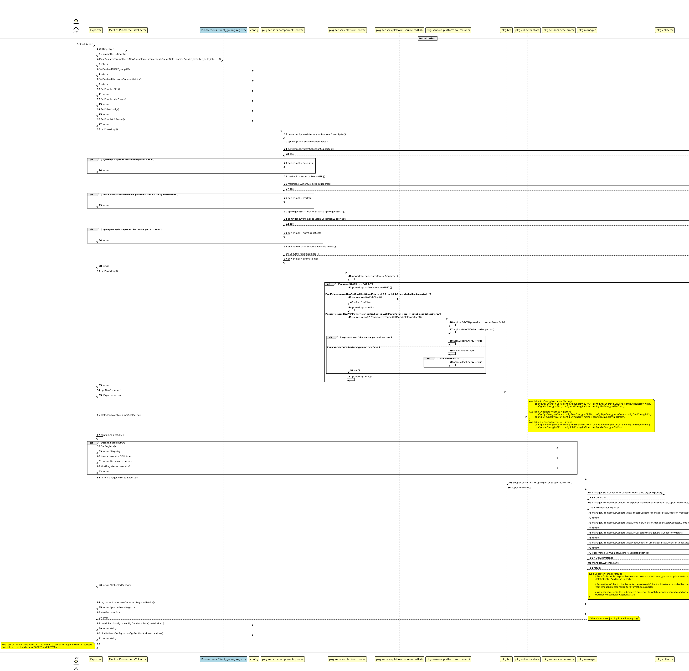

# Kepler

The goal of this doc is to document the current behavior of Kepler

## Exporter

Package: cmd/exporter

The exporter is the main Kepler program.

The following diagram is a high level representations of the Kepler
exporter components:



The following diagram represents that startup sequence for the Kepler
exporter:



The exporter performs the following operations:

* Starts the various power collection implementations needed to collect metrics
  from the platform as well as its components (dram, uncore, core, package).
* Creates a bpf exporter (role explained below).
* Creates a collector manager to collect and expose the collected metrics (role explained below).
* Creates a http server that services incoming requests.

## BPF Exporter

Package: pkg/bpf

The bpf exporter is created in the main kepler program through

```golang
 m := manager.New(bpfExporter)
```

The role of the bpf exporter includes:

1. Modifies the eBPF program sampling rate and number of CPUs.
1. Loads the eBPF program.
1. Attaches the `KeplerSchedSwitchTrace` eBPF program.
1. Attaches the `KeplerIrqTrace` eBPF program if `config.ExposeIRQCounterMetrics` is enabled.
1. Initializes `enabledSoftwareCounters`.
1. Attaches the `KeplerWritePageTrace` eBPF program.
1. Attaches the `KeplerWritePageTrace` eBPF program.
1. If `config.ExposeHardwareCounterMetrics` is enabled it creates the following hardware perf events:
   1. CpuInstructionsEventReader
   1. CpuCyclesEventReader
   1. CacheMissEventReader

   It also initializes `enabledHardwareCounters`.

> **_NOTE_**: Kepler currently uses eBPF perf buffers (Perfbuf) to collect some of the stats.
"Perfbuf is a collection of per-CPU circular buffers, which allows to efficiently exchange data
between kernel and user-space. It works great in practice, but due to its per-CPU design it
has two major short-comings that prove to be inconvenient in practice: inefficient use of
memory and event re-ordering" [[1]].

## Collector Manager

The Kepler exporter (cmd/exporter) creates an instance of the collector manager.
The collector manager contains the following items:

* `StatsCollector` that is responsible for collecting resource and energy consumption metrics.
* `PrometheusCollector` which is a prometheus exporter that exposes the Kepler metrics on a
   Prometheus-friendly URL.
* `Watcher` that watches the Kubernetes API server for pod events.

```golang
type CollectorManager struct {
    // StatsCollector is responsible to collect resource and energy consumption metrics and calculate them when needed
    StatsCollector *collector.Collector

    // PrometheusCollector implements the external Collector interface provided by the Prometheus client
    PrometheusCollector *exporter.PrometheusExporter

    // Watcher register in the kubernetes apiserver to watch for pod events to add or remove it from the ContainerStats map
    Watcher *kubernetes.ObjListWatcher
}
```

### StatsCollector

Package: pkg/manager

TODO

### PrometheusCollector

Package: pkg/manager

`PrometheusCollector` is a prometheus exporter.

[1]: https://nakryiko.com/posts/bpf-ringbuf/
