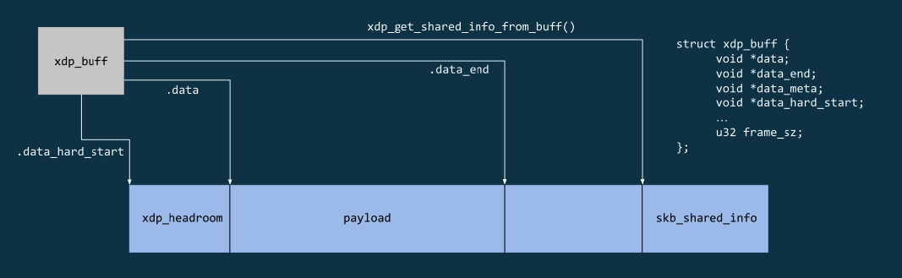

# xdp-hints

The following diagram shows the call sequence to pass xdp-hints from the ixgbe-driver
to an application using AF_XDP.


> **_NOTE:_** xskq_prod_reserve_desc() will enqueue a descriptor to the AF_XDP
Receive Ring - which will later be consumed by CNDPs xskdev API.

## struct xdp_buff

xdp-hints are stored in the flags field in struct xdp_buff. The xdp_buff
struct is passed all the way from the driver ixgbe_clean_rx_irq() function
to __xsk_rcv_zc(). At __xsk_rcv_zc() the information contained in xdp_buff
is converted/passed to a descriptor that gets added to the AF_XDP receive
ring. The idea is to reuse the options field in struct xdp_desc to pass the
hints flags to CNDP.

```c
struct xdp_buff {
    void *data;
    void *data_end;
    void *data_meta;
    void *data_hard_start;
    struct xdp_rxq_info *rxq;
    struct xdp_txq_info *txq;
    u32 frame_sz; /* frame size to deduce data_hard_end/reserved tailroom*/
    u32 flags; /* supported values defined in xdp_buff_flags */
};
```



```c
/* Rx/Tx descriptor */
struct xdp_desc {
    __u64 addr;
    __u32 len;
    __u32 options;
};
```

## xdp_do_redirect ()

xdp_do_redirect() selects the redirection function based on the map type

```c
int xdp_do_redirect(struct net_device *dev, struct xdp_buff *xdp,
            struct bpf_prog *xdp_prog)
{
    struct bpf_redirect_info *ri = this_cpu_ptr(&bpf_redirect_info);
    enum bpf_map_type map_type = ri->map_type;

    /* XDP_REDIRECT is not fully supported yet for xdp frags since
     * not all XDP capable drivers can map non-linear xdp_frame in
     * ndo_xdp_xmit.
     */
    if (unlikely(xdp_buff_has_frags(xdp) &&
             map_type != BPF_MAP_TYPE_CPUMAP))
        return -EOPNOTSUPP;

    if (map_type == BPF_MAP_TYPE_XSKMAP)
        return __xdp_do_redirect_xsk(ri, dev, xdp, xdp_prog);

    return __xdp_do_redirect_frame(ri, dev, xdp_convert_buff_to_frame(xdp),
                       xdp_prog);
}
```

> **_NOTE:_** struct xdp_buff *xdp is passed all the way through to __xsk_rcv_zc()
where it's then replaced with an xsk descriptor using the xskq_prod_reserve_desc()
function.

## __xsk_rcv_zc ()

The information container in struct xdp_buff *xdp is used to configure a descriptor
of type struct xdp_desc. This information in configured in the xskq_prod_reserve_desc()
function.

```c
static int __xsk_rcv_zc(struct xdp_sock *xs, struct xdp_buff *xdp, u32 len)
{
    struct xdp_buff_xsk *xskb = container_of(xdp, struct xdp_buff_xsk, xdp);
    u64 addr;
    int err;

    addr = xp_get_handle(xskb);
    err = xskq_prod_reserve_desc(xs->rx, addr, len, xdp->flags);
    if (err) {
        xs->rx_queue_full++;
        return err;
    }

    xp_release(xskb);
    return 0;
}
```

## xskq_prod_reserve_desc()

```c
static inline int xskq_prod_reserve_desc(struct xsk_queue *q,
                     u64 addr, u32 len, u32 flags)
{
    struct xdp_rxtx_ring *ring = (struct xdp_rxtx_ring *)q->ring;
    u32 idx;

    if (xskq_prod_is_full(q))
        return -ENOBUFS;

    /* A, matches D */
    idx = q->cached_prod++ & q->ring_mask;
    ring->desc[idx].addr = addr;
    ring->desc[idx].len = len;
    ring->desc[idx].options = flags;

    return 0;
}
```

## AF_XDP Ring reference


